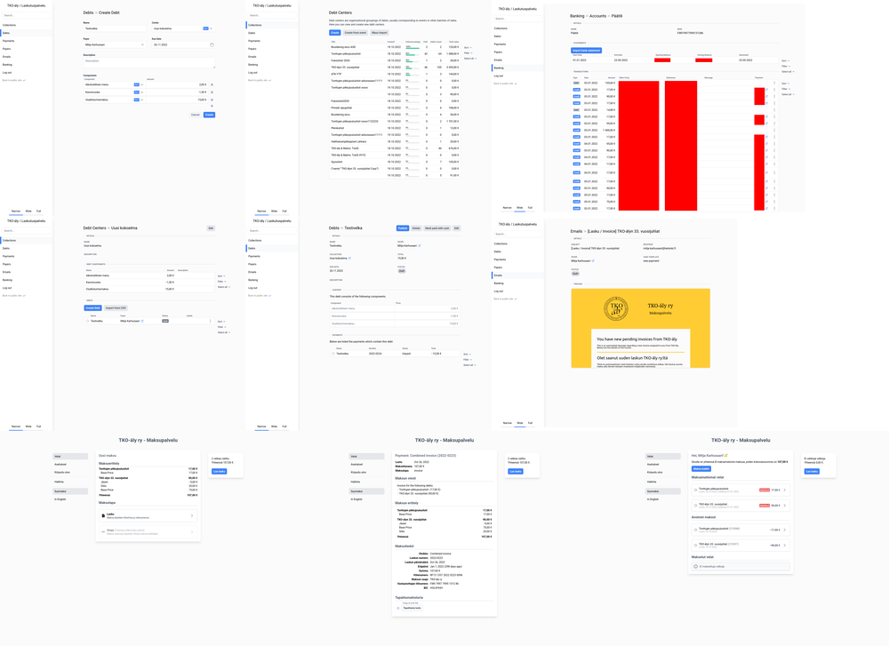
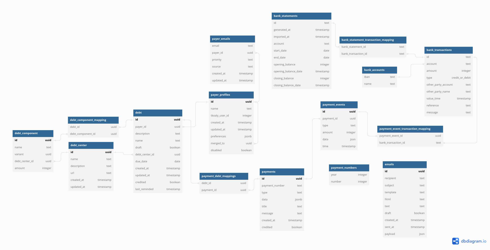

# Baseball Bat - TKO-äly's Event Payment Platform

Baseball bat is a web platform with the aim of reducing our organization's treasurer's workload by automating different parts of the event fee billing process.
In the future the platform will hopefully enable online payments via Stripe and make collaboration between the treasurer, assisting treasurer and the event organizers easier.

- [Features](#features)
- [Development Environment](#development-environment)
- [Architecture](#architecture)
- [Screenshots](./docs/screenshots/README.md)

## Features

 - [x] Importing events and registrations from [our event calendar](https://members.tko-aly.fi/) and creating invoices from those based on customizable set of rules. 
 - [x] Sending emails to members about new invoices
 - [x] Sending payment notices to members about overdue invoices automatically
 - [x] Keeping track of which payments have been paid by associating bank transactions either automatically using the reference number or manually 
 - [x] Import bank transactions using an electronic bank statement in the CAMT.052 XML format
 - [ ] Allow members to view their paid and unpaid debts
 - [ ] Allow members to pay all their debts using a single payment
 - [ ] Allow members to pay online using Stripe

## Screenshots

[ View Screenshots](./docs/screenshots/README.md)

## Development Environment

### "Standalone" Installation

This service depends on the following other TKO-äly services, so go and setup those first:

 - Members service 
 - Events microservice
 - Users microservice

To set up the development environment do the following:

 - Copy the `.env.example` file to `.env` and populate the environment variables according to the comments in the file.
 - Run `docker-compose up -d` to start up the containers
 - Run `npx node-pg-migrate -d POSTGRES_CONNECTION_STRING up` to run the database migrations
 - Run `yarn start:dev` to start the development server

### Common TKO-äly Development Environment

Better way to setup the service is by using the [tko-aly.localhost repository](https://github.com/TKOaly/tko-aly.localhost) which includes all the required services, _completely containerized_, and a Traefik installation which routes all the services to domains under `.tko-aly.localhost`.

## Architecture

### Design Scenario

The data model is designed to be able to handle the following scenario:

 - User signs up as TKO-äly member using the email address `janne.jasen@gmail.com`
 - User registers to a TKO-äly event outside of our event calendar (for example Google Forms or similar, which are sometimes used), and uses the (different) email address `janne.jasen@helsinki.fi`
 - User registers to an another TKO-äly event using the event calendar
 - User receives an invoice sent to `janne.jasen@helsinki.fi` but it goes unnoticed
 - User receives an invoice sent to `janne.jasen@gmail.com` and clicks the link in the invoice message
 - User wants to pay both of their debts using a single transfer and generates a new reference number for that purpose
 - User makes a transaction using the correct reference number but enters the amount incorrectly
 - User receives a notification about the mistake from the system and either pays the difference, in case of underpayment, or the receives the overpaid amount from the treasurer

There are four main things that make this scenario difficult to handle correctly:

 - There are two profiles for the user in the system: one with the email `janne.jasen@gmail.com` and an associated membership ID, and one with the email `janne.jasen@helsinki.fi` and no associated membership ID. The system must be able to merge these two profiles, when the fact that these are the same user transpires.
 - The system must be able to handle under- and overpayment and multiple transactions and payment events towards a single payment.
 - A single payment must be able to cover multiple debts.
 - When user pays the _combined invoice_, which covers the two debts, there still remains the invoices originally generated for these debts and that were sent using email to the user. These old invoices must be automatically credited or invalidated.

### Database

### Backend
